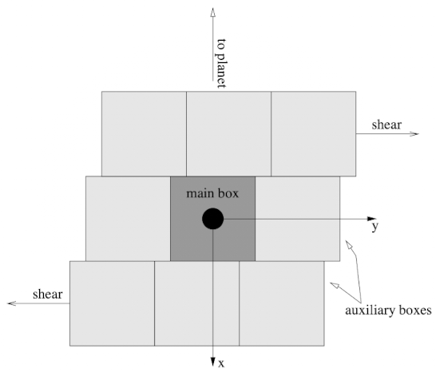

# Boundary conditions

You can use different boundary conditions with REBOUND. 

## No boundaries
By default, REBOUND doesn't use boundary conditions.
This means particle can have arbitrary coordinates in all three dimensions (as long as they can be represented as floating point numbers). 
Because this is the default setting, you don't need to do anything if you don't want boundary conditions.
Nevertheless, here is the syntax to set this manually:
=== "C"
    ```c
    struct reb_simulation* r = reb_create_simulation();
    r->boundary = REB_BOUNDARY_NONE;
    ```

=== "Python"
    ```python
    sim = rebound.Simulation()
    sim.boundary = "none"
    ```

## Open
When open boundary conditions are selected, particles are removed from the simulation if they leave the simulation box.
You therefore also need to set the size of the simulation box whenever you use open boundary conditions. 
The syntax is as follows:

=== "C"
    ```c
    struct reb_simulation* r = reb_create_simulation();
    reb_configure_box(r, 10., 1, 1, 1); # confine the simulation to a box of size 10
    r->boundary = REB_BOUNDARY_OPEN;
    ```

=== "Python"
    ```python
    sim = rebound.Simulation()
    sim.configure_box(10.)   # confine the simulation to a box of size 10
    sim.boundary = "open"
    ```

## Periodic
When periodic boundary conditions are uses, particles are reinserted on the opposite side if they leave a simulation box. 
You can use an arbitrary number of ghost-boxes with this module.
The syntax is as follows:

=== "C"
    ```c
    struct reb_simulation* r = reb_create_simulation();
    reb_configure_box(r, 10., 1, 2, 3); # confine the simulation to a box of size 10x20x30
    r->boundary = REB_BOUNDARY_PERIODIC;
    ```

=== "Python"
    ```python
    sim = rebound.Simulation()
    sim.configure_box(10., 1, 2, 3)   # confine the simulation to a box of size 10x20x30
    sim.boundary = "periodic"
    ```

## Shear


These are shear periodic boundary conditions. 
They are similar to periodic boundary conditions, but ghost-boxes are moving with constant speed, set by the shear.
This is useful when simulation a small patch in a ring or disk. 
You also need to set the `OMEGA` variable in the simulation which set the epicyclic frequency.
For more information on how to setup simulations of planetary rings in REBOUND, see [Rein & Liu](https://ui.adsabs.harvard.edu/abs/2012A%26A...537A.128R/abstract). 

=== "C"
    ```c
    struct reb_simulation* r = reb_create_simulation();
    reb_configure_box(r, 10., 1, 1, 1); 
    r->OMEGA = 1.0;
    r->boundary = REB_BOUNDARY_SHEAR;
    ```

=== "Python"
    ```python
    sim = rebound.Simulation()
    sim.configure_box(10.)
    sim.OMEGA = 1.0
    sim.boundary = "shear"
    ```
