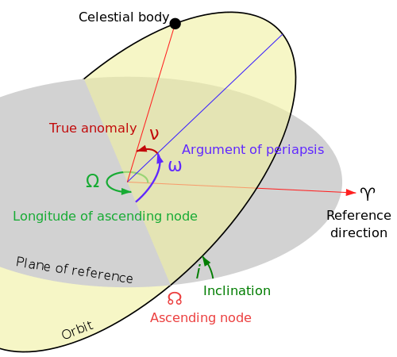

# Orbital elements

This section discusses orbital parameters.
We focus on the implementation and conventions in REBOUND.


The following image illustrated the most important angles used.
In REBOUND the reference direction is the positive x direction, the reference plane
is the xy plane.



## Orbit structure 

Variable name   | Description
--------------- | ------------
`d`             | radial distance from reference 
`v`             | velocity relative to central object's velocity
`h`             | specific angular momentum
`P`             | orbital period (negative if hyperbolic)
`n`             | mean motion    (negative if hyperbolic)
`a`             | semimajor axis
`e`             | eccentricity
`inc`           | inclination
`Omega`         | longitude of ascending node
`omega`         | argument of pericenter
`pomega`        | longitude of pericenter
`f`             | true anomaly
`M`             | mean anomaly
`E`             | Eccentric anomaly. Because this requires solving Kepler's equation it is only calculated when needed in python and never calculated in C. To get the eccentric anomaly in C, use the function `double reb_tools_M_to_E(double e, double M)`
`l`             | mean longitude = Omega + omega + M
`theta`         | true longitude = Omega + omega + f
`T`             | time of pericenter passage
`rhill`         | Hill radius, $r_{\rm hill} =a\sqrt[3]{\frac{m}{3M}}$

!!! Important
    All angles in REBOUND are in radians. 
    Variables which have length, time or velocity units use code units.

## Conversion functions
### True anomaly

The following function returns the true anomaly $f$ for a given eccentricity $e$ and mean anomaly $M$:
=== "C"
    ```c
    double f = reb_tools_M_to_f(0.1, 1.); // e=0.1, M=1.0
    ```

=== "Python"
    ```python
    f = rebound.M_to_f(0.1, 1.0) # e=0.1, M=1.0
    ```


The following function returns the true anomaly $f$ for a given eccentricity $e$ and eccentric anomaly $E$:
=== "C"
    ```c
    double f = reb_tools_E_to_f(0.1, 1.); // e=0.1, E=1.0
    ```

=== "Python"
    ```python
    f = rebound.E_to_f(0.1, 1.0) # e=0.1, E=1.0
    ```

### Eccentric anomaly

The following function returns the eccentric anomaly $E$ for a given eccentricity $e$ and mean anomaly $M$:
=== "C"
    ```c
    double f = reb_tools_M_to_E(0.1, 1.); // e=0.1, M=1.0
    ```

=== "Python"
    ```python
    f = rebound.M_to_E(0.1, 1.0) # e=0.1, M=1.0
    ```
